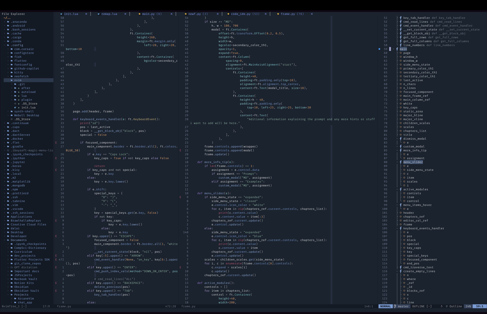
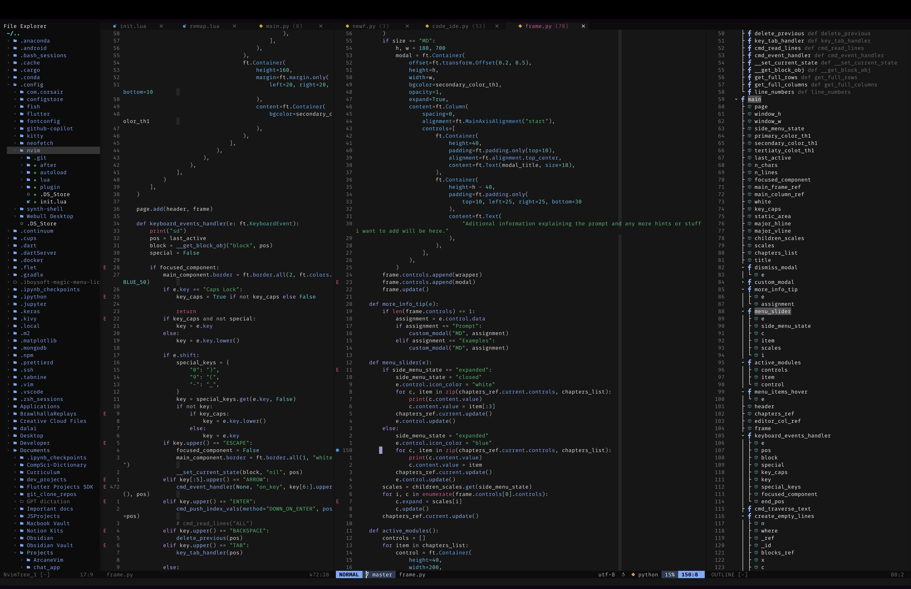
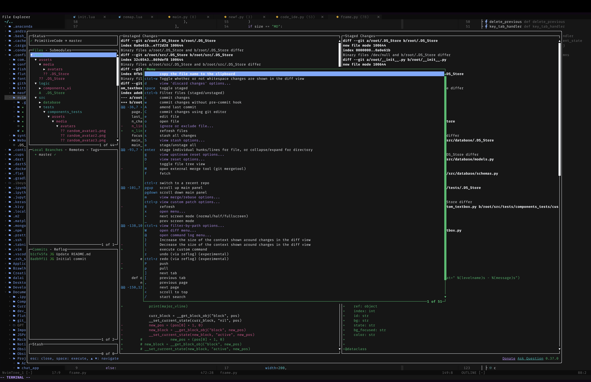

# ArcaneVim

ArcaneVim is a powerful and customizable Vim configuration designed for advanced users who want to unlock the full potential of their text editor.

### Features

Advanced syntax highlighting for a wide variety of programming languages and file formats
Powerful code completion and navigation tools, including support for tags, ctags, and more
Customizable keybindings and macros that allow you to automate complex workflows and streamline your editing experience
Support for a wide variety of plugins and extensions, including popular options like Vim-Plug and Pathogen
Seamless integration with Git and other version control systems, allowing you to easily manage and collaborate on your code projects
Extensive documentation and support resources, including a comprehensive user manual, a helpful online community, and regular updates and bug fixes

## Getting Started

To get started with ArcaneVim, simply clone the repository to your local machine and follow the installation instructions in the user manual. Once installed, you can customize the configuration to suit your specific needs and preferences, and take advantage of the many advanced features and tools that ArcaneVim has to offer.

## Contributing

ArcaneVim is an open-source project, and we welcome contributions from developers and users around the world. If you have a suggestion or feature request, or if you would like to help improve the project, please feel free to submit a pull request or open an issue on the project's GitHub repository.

## Plugins

Here's a list of some of the plugins included in ArcaneVim:

| Plugin | Description |
| ------ | ----------- |
| [packer.nvim](https://github.com/wbthomason/packer.nvim) | Plugin manager for Neovim written in Lua |
| [telescope.nvim](https://github.com/nvim-telescope/telescope.nvim) | Highly extendable fuzzy finder over lists |
| [plenary.nvim](https://github.com/nvim-lua/plenary.nvim) | All the lua functions I don't want to write twice |
| [lazygit.nvim](https://github.com/kdheepak/lazygit.nvim) | Simple neovim UI for git commands |
| [nvim-treesitter](https://github.com/nvim-treesitter/nvim-treesitter) | Nvim Treesitter configurations and abstraction layer |
| [playground](https://github.com/nvim-treesitter/playground) | Treesitter playground integrated into Neovim |
| [harpoon](https://github.com/ThePrimeagen/harpoon) | Navigate between files in different directories with ease |
| [undotree](https://github.com/mbbill/undotree) | The undo history visualizer for VIM |
| [nvim-cmp](https://github.com/hrsh7th/nvim-cmp) | Autocompletion plugin |
| [nvim-autopairs](https://github.com/windwp/nvim-autopairs) | Autopairs plugin for Neovim written in Lua |
| [vim-fugitive](https://github.com/tpope/vim-fugitive) | A Git wrapper so awesome, it should be illegal |
| [vim-autopep8](https://github.com/tell-k/vim-autopep8) | Use autopep8 to beautify your Python code in Vim |
| [nightfox.nvim](https://github.com/EdenEast/nightfox.nvim) | Dark and light colorscheme written in lua for Neovim |
| [winresizer](https://github.com/simeji/winresizer) | Resizer for Neovim windows |
| [vim-surround](https://github.com/tpope/vim-surround) | quoting/parenthesizing made simple |
| [better-escape.nvim](https://github.com/max397574/better-escape.nvim) | A simple and easy to use plugin for escaping insert mode |
| [nerdcommenter](https://github.com/preservim/nerdcommenter) | Vim plugin for intensely orgasmic commenting |
| [prettierd](https://github.com/fsouza/prettierd) | Prettier plugin for Neovim using prettierd |
| [nvim-ts-autotag](https://github.com/windwp/nvim-ts-autotag) | Use treesitter to auto close and auto rename html tag |

## Preview

## Keymaps
These remaps can be changed or modified in ./lua/custom/remaps.lua

| Key(s)     | Mapping                      | Description                                                  |
|------------|------------------------------|--------------------------------------------------------------|
| `<leader>` | `" "`                        | Sets the leader key to space                                 |
| `k`        | `k`                          | Move cursor up in normal mode and visual mode                |
| `j`        | `h`                          | Move cursor left in normal mode and visual mode              |
| `;`        | `l`                          | Move cursor right in normal mode and visual mode             |
| `l`        | `j`                          | Move cursor down in normal mode and visual mode              |
| `K`        | `10k`                        | Move cursor up 10 lines in normal mode                       |
| `L`        | `10j`                        | Move cursor down 10 lines in normal mode                     |
| `,j`       | `<C-w>h`                     | Move cursor to the left split in visual mode and normal mode |
| `,;`       | `<C-w>l`                     | Move cursor to the right split in visual mode and normal mode|
| `,k`       | `<C-w>k`                     | Move cursor to the above split in visual mode and normal mode|
| `,l`       | `<C-w>j`                     | Move cursor to the below split in visual mode and normal mode|
| `<leader>n`| `:w<CR>`                     | Save file in normal mode                                     |
| `L`        | `:m '>+1<CR>gv=gv`           | Move selected text down in visual mode                        |
| `K`        | `:m '<-2<CR>gv=gv`           | Move selected text up in visual mode                          |
| `J`        | `mzJ\z\``                    | Join the current line with the next line in normal mode       |
| `<C-d>`    | `<C-d>zz`                    | Scroll down in normal mode                                    |
| `<C-u>`    | `<C-u>zz`                    | Scroll up in normal mode                                      |
| `n`        | `nzzzv`                      | Move to next search result and center the screen in normal mode|
| `N`        | `Nzzzv`                      | Move to previous search result and center the screen in normal mode|
| `<leader>p`| `["_dP]`                     | Paste the content of the default register at the current position in visual mode|
| `<leader>y`| `["+y]`                      | Copy selected text to the system clipboard in normal and visual mode|
| `<leader>Y`| `["+Y]`                      | Copy current line to the system clipboard in normal mode     |
| `<leader>d`| `["_d]`                      | Delete selected text in normal and visual mode                |
| `Q`        | `<nop>`                      | Disable the Q key in normal mode                              |
| `<leader>f`| `vim.lsp.buf.format`         | Format code using the Language Server Protocol (LSP) in normal mode |
| `<C-k>`    | `<cmd>cnext<CR>zz`           | Move to the next error in the quickfix list and center the screen in normal mode |
| `<C-j>`    | `<cmd>cprev<CR>zz`           | Move to the previous error in the quickfix list and center the screen in normal mode |

## Defalt configuration

These can be modified in ./lua/custom/set.lua

| Key              | Action                                                                   |
|------------------|--------------------------------------------------------------------------|
| vim.opt.guicursor | Set the GUI cursor to the default value.                                 |
| vim.opt.nu        | Enable line numbers.                                                     |
| vim.opt.relativenumber | Enable relative line numbers.                                          |
| vim.opt.tabstop   | Set the width of a tab to 4 spaces.                                      |
| vim.opt.softtabstop | Set the number of spaces inserted for a tab character to 4.             |
| vim.opt.shiftwidth | Set the number of spaces to use for each step of indent to 4.            |
| vim.opt.expandtab | Convert tabs to spaces.                                                  |
| vim.opt.smartindent | Enable smart indentation.                                               |
| vim.opt.wrap      | Enable text wrapping.                                                    |
| vim.opt.swapfile  | Disable swap file creation.                                              |
| vim.opt.backup    | Disable backup file creation.                                            |
| vim.opt.undodir   | Set the location of the undo directory to ~/.vim/undodir.                |
| vim.opt.undofile  | Enable persistent undo.                                                  |
| vim.opt.hlsearch  | Disable highlighting of search results.                                  |
| vim.opt.incsearch | Enable incremental search.                                               |
| vim.opt.termguicolors | Enable true colors in the terminal.                                    |
| vim.opt.scrolloff | Set the number of lines to keep above and below the cursor to 8.          |
| vim.opt.signcolumn | Enable sign column.                                                      |
| vim.opt.isfname   | Append @-@ to the isfname option to allow filenames with -.               |
| vim.opt.updatetime | Set the time interval for writing the swap file to 50ms.                |
| vim.opt.colorcolumn | Highlight column 80.                                                     |

